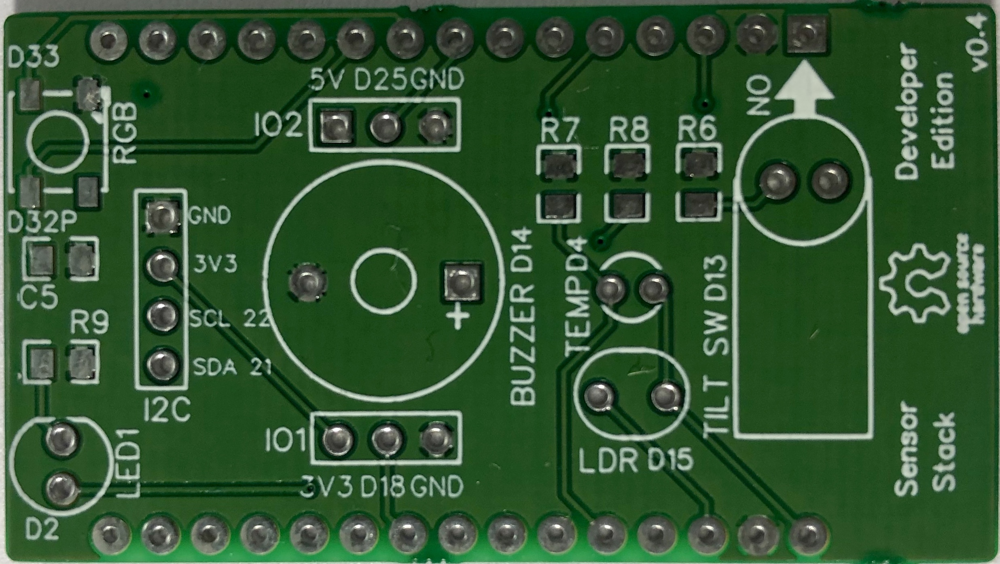

# Sensor Stack Developer Edition

**Plug and Play Open Source IoT Hardware Add-on for beginners, developers, and geeks.**

**Transform your ideas into real life working demos without getting into the complexities of electronic circuits.**

**Get yours at: https://appliot.org**

# Driving forces

 **Plug and Play -** ESP32 Dev Kit compatible plug-and-play adapter board can get you started in minutes.

 **Open Source Design -** Enable developers to customize their own add-on board without much hassle

 **Community Initiative -** Community backing ensures that product remain bug free and keeps evolving with time

# Take a look inside:
Simified design packed with multiple Sensors (Temperature, Light) and Actuators (LED, RGB, Tilt Switch, and Buzzer), 2 dedicated IO's (3.3v & 5v) and an I2C port to let you play around with a lot of your use cases.

*Connect a 4-pin I2C OLED Display to show readings from on-board Sensors (Not included in package).*  

# Build your own:
Use as is or Make your own. Example Code and Design Files (Gerber, PCB Layout, and schematic) are provided to get started. Or if you are an enthusiast you can contribute your Design/Code.

# Sensors and Peripherals:

| ##  | Sensors and Peripherals        | Function           | Type           | GPIO |
| --- | ------------------------------ | ------------------ |--------------- | ---  |
| 01  | NTC Thermister                 | Temperature Sensor | Analog Input   | 04   |
| 02  | Light Dependent Resistor (LDR) | Light Sensor       | Analog Input   | 15   |
| 03  | Tilt Switch                    | Orientation        | Digital Input  | 13   |
| 04  | Buzzer                         | Sound              | Digital Output | 14   |
| 05  | RGB LED (Light-emitting diode) | Light/Colors       | Digital Output | 33   |
| 06  | LED (Light-emitting diode)     | Light              | Digital Output | 02   | 

# How to use:
**Supports ESP32 devkit boards only**

Plug your sensor stack in correct orientation on Generic ESP32 Devkit (refer to the ESP32 and Micro USB indicators on the back), Load Device-Test.ino using Arduino IDE. Fire-up your serial monitor to see the sensor values and other indications on board.

*Required Software, Packages, and Drivers:*

- Arduino IDE: [Click here to Download](https://www.arduino.cc/en/Main/Software)
- Espressif Arduino repository to install ESP32 Board Manager: [Click here to Download](https://github.com/espressif/arduino-esp32#using-through-arduino-ide)
- CP2102/CP2104 USB Driver: [Click here to Download](http://www.silabs.com/products/development-tools/software/usb-to-uart-bridge-vcp-drivers)

# Use Case (Samples):

- **Change RGB LED color based on room temperature using on-board Thermister.**

- **Turn on LED ON/OFF based on ambient lighting condition using Light Dependent Resistor (LDR).**

- **Turn ON/OFF your device/peripherals based on Tilt Switch Orientation.** 

**More use cases to be added later*

# License

   Licensed under the Apache License, Version 2.0 (the "License");
   you may not use this file except in compliance with the License.
   You may obtain a copy of the License at

       http://www.apache.org/licenses/LICENSE-2.0

   Unless required by applicable law or agreed to in writing, software
   distributed under the License is distributed on an "AS IS" BASIS,
   WITHOUT WARRANTIES OR CONDITIONS OF ANY KIND, either express or implied.
   See the License for the specific language governing permissions and
   limitations under the License.

# Credits

Thanks to 

- All the contributors for idea and initial setup of this project.
- All the contributors/communities for major design and code contributions to this project.
